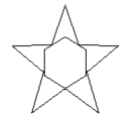

# Лабораторные работы по Компьютерной Графике

> - [x] [Работа 1.](1лаба) Аналитическая геометрия - Вариант 4

- [x] [Задание 1.](1лаба/1.py)
```
  Определить принадлежит ли точка прямой. Прямая задана своими коэффициентами.
```
- [x] [Задание 2.](1лаба/2.py)
```
  Даны три точки А,В,С. Определить принадлежит ли точка С лучу АВ.
```
- [x] [Задание 3.](1лаба/3.py)
```
  Даны три точки А,В,С, определить является ли обход А-В-С обходом по часовой
стрелке или против (точки заданы на плоскости).
```
- [x] [Задание 4.](1лаба/4.py)
```
  Заданы коэффициенты уравнения плоскости и координаты точки.
Определить принадлежит ли точка плоскости.
``` 
- [x] [Задание 5.](1лаба/5.py)
```
      Дана окружность (центр окружности и радиус) и точка P.
Найти точки пересечения окружности и касательных прямых проходящих через точку P.
```

> - [x] [Работа 2.](2лаба) Геометрические преобразования - Вариант 5
  
- [x] 1. Часть первая.
```
  Реализовать с заданной совокупностью фигур преобразования:
    ● перенос вдоль оси OX,
    ● перенос вдоль оси OY,
    ● отражение относительно оси OX,
    ● отражение относительно оси OY,
    ● отражение относительно прямой Y=X,
    ● масштабирование независимо по обеим осям,
    ● поворот на заданный угол относительно центра координат
    ● поворот на заданный угол относительно произвольной точки, указываемой в ходе выполнения программы.
    ● Предусмотреть восстановление исходной позиции фигур, применение нескольких преобразований.
    Управление организовать через меню, кнопки и т.д.
    ● Начало координат должно быть расположено в центре окна.
```
[Приложение](2лаба/app.py)
[Методы](2лаба/changes.py)


- [x] 2. Часть вторая.
```
  Разработать программу, имитирующую падение снежинок.
```
   - [1 вариант](2лаба/2_1.py)
   - [2 вариант](2лаба/2_2.py)
   - [3 вариант](2лаба/2_3.py)
     

> - [x] [Работа 3.](3лаба) Растеризация отрезка и окружности
```
  Реализовать алгоритмы Брезенхема растеризации отрезка и окружности (все вычисления
должны выполняться в целых числах).
  Входные данные: целочисленные координаты концов отрезка (в координатах сетки),
радиус и координаты центра окружности.
  Выходные данные: изображение сетки, узлы которой являются пикселями, изображение
отрезка стандартным методом, результат работы алгоритма, в виде отмеченных пикселей.
  (Тоже самое для окружности)
```


> - [x] [Работа 4.](4лаба) Отсечение отрезка многоугольником
```
  Состоит из трех частей:
  1. Реализовать алгоритм Цируса-Бека отсечения отрезка многоугольником.
  2. Реализовать алгоритм Сазерленда-Коэна.
  3. Реализовать алгоритм средней точки.

  Для каждой части:
  Входные данные: координаты вершин многоугольника (прямоугольника),
координаты концов отрезка.
  Выходные данные: изображение многоугольника (прямоугольника), изображение
отрезка, отмечены все потенциальные точки входа и выхода (для первой части), часть
отрезка внутри многоугольника (прямоугольника) выделена другим цветом.
```


> - [ ] [Работа 5.](5лаба) Заполнение областей - Вариант 5
```
  Алгоритм XOR-2 с перегородкой.

  Входные данные: координаты вершин многоугольника и координаты точки(для вар.6, 7).
  Выходные данные: изображение многоугольника, многоугольник закрашивается по
шагам, каждый шаг – несколько шагов алгоритма.
  (пошаговое построение означает демонстрацию принципа работы алгоритма, т.е.
при демонстрации должно быть понятно какой алгоритм реализован).
```


> - [x] [Работа 6.](6лаба) Выпуклая оболочка - Вариант 4
```
  Алгоритм Джарвиса.

  Входные данные: координаты точек
  Выходные данные: пошаговое построение выпуклой оболочки заданного набора точек
  (пошаговое построение означает демонстрацию принципа работы алгоритма, т.е.
при демонстрации должно быть понятно какой алгоритм реализован).
```
